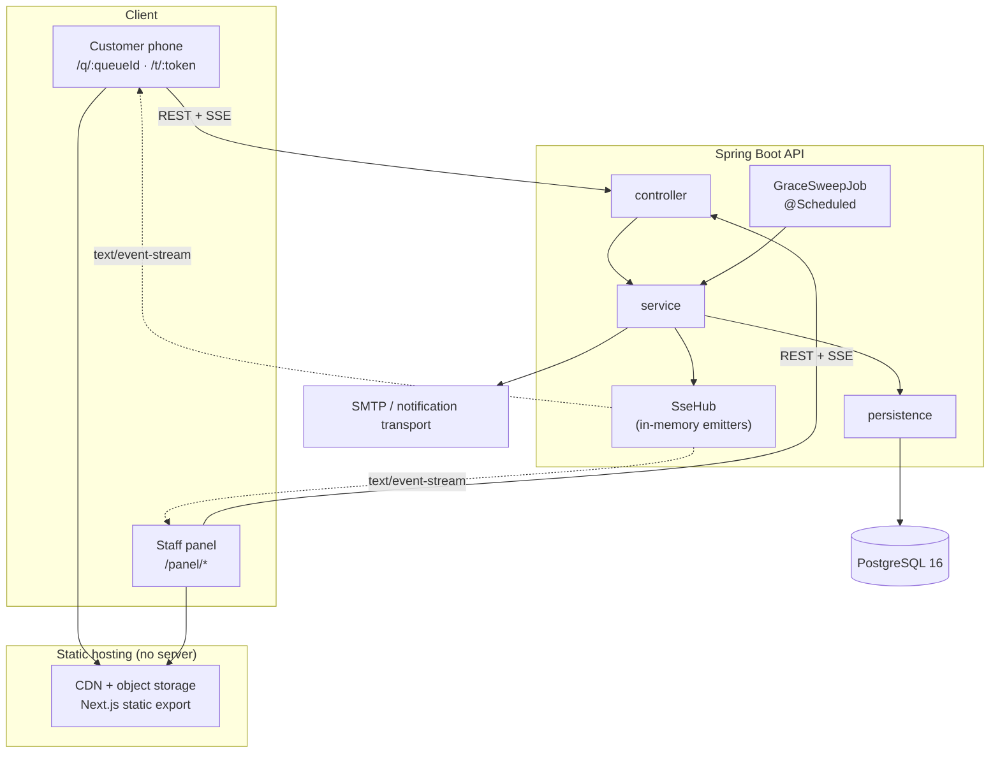
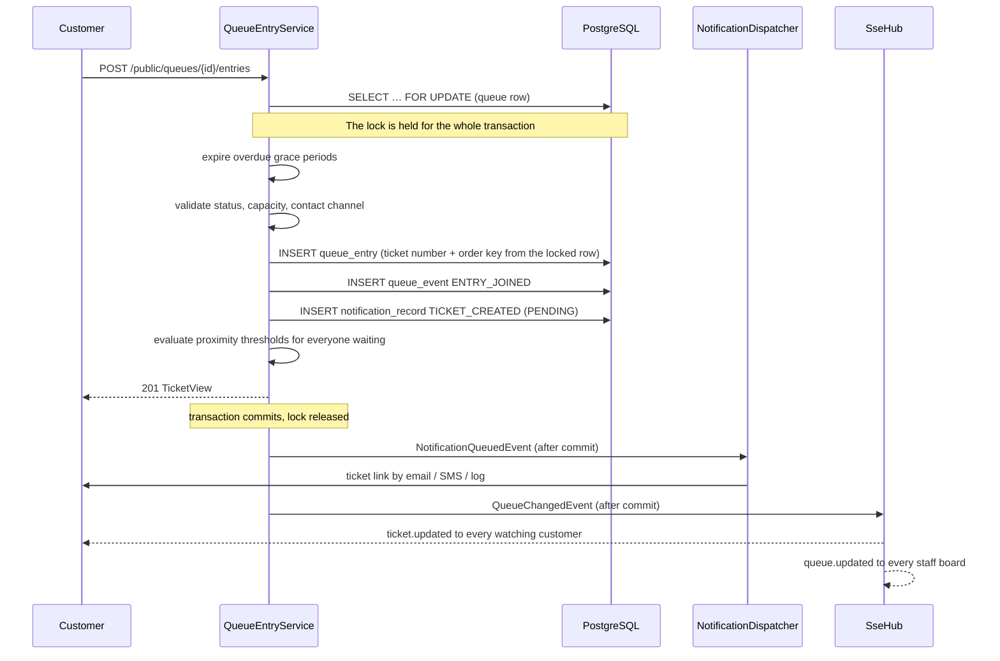
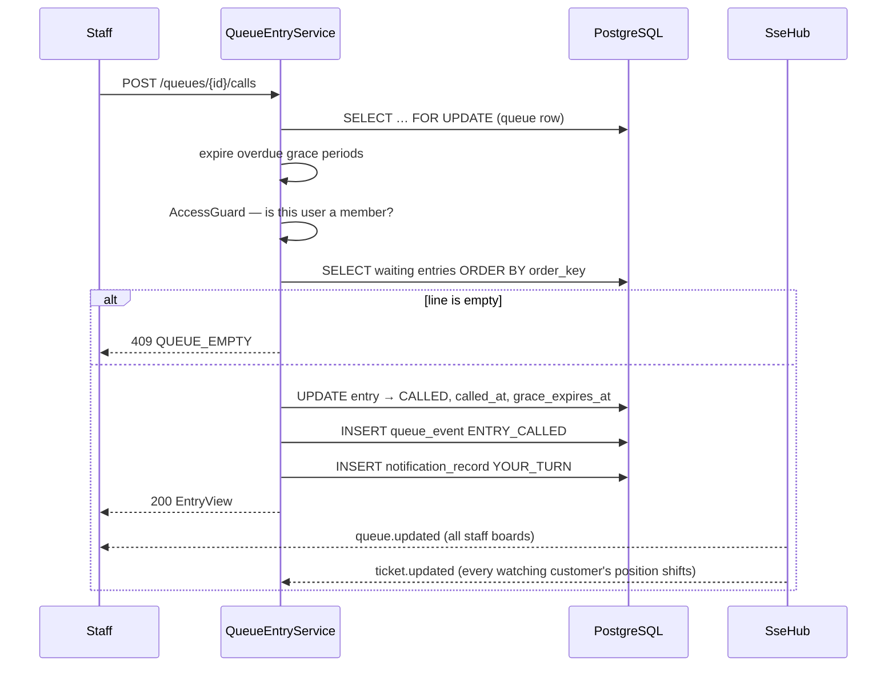
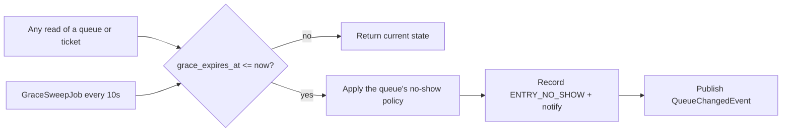
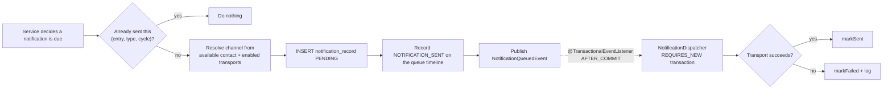
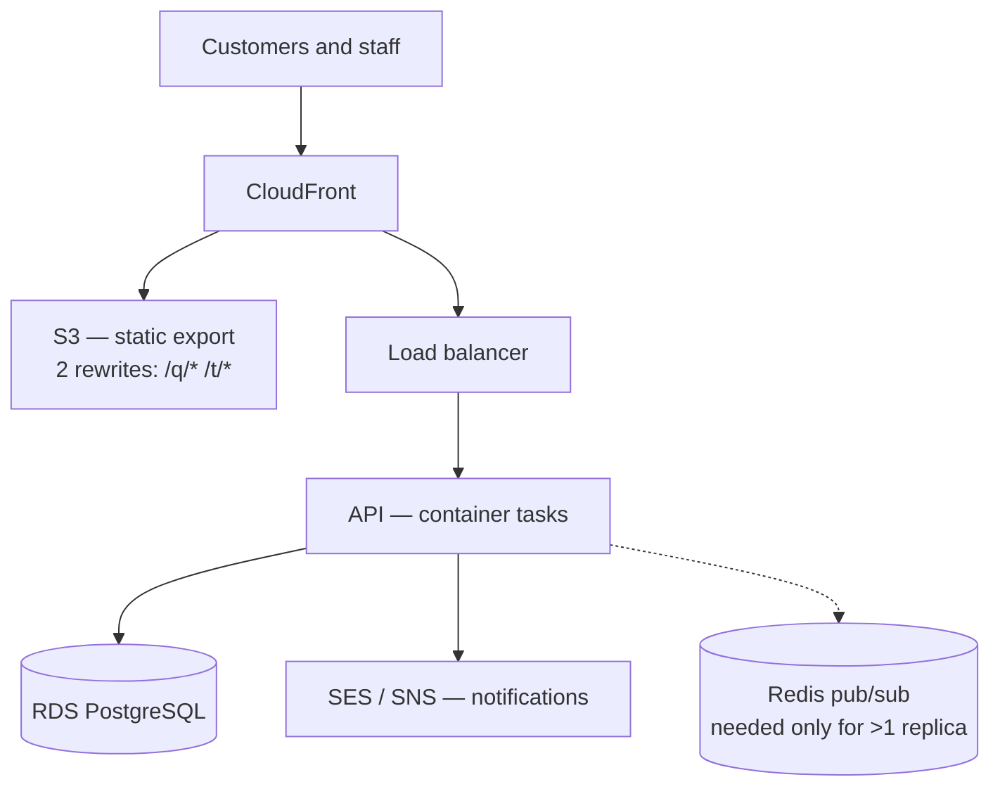

# Q — Architecture, Design and Decisions

> ITBA 82.08 Cloud Computing · Trabajo Práctico · Grupo 9
> Nicolás Koron · José María Benegas Lynch · Agustín Galán · Nicolás Bellavitis Alzate

This document explains how Q is built and, more importantly, **why it is built that way**. Where a
decision had a credible alternative, the alternative is named and the trade-off is stated.

Companion documents:

| Document | Covers |
|---|---|
| [domain-model.md](domain-model.md) | Entities, the entry state machine, business rules |
| [api-reference.md](api-reference.md) | Every endpoint, error code and payload |
| [frontend.md](frontend.md) | Frontend implementation notes and design language |
| [../README.md](../README.md) | Getting it running |

---

## 1. Purpose and scope

Q digitises waiting in places where people queue physically: restaurants, shops, service counters.
A customer scans a QR code, joins the line with minimal data, and follows their turn from their own
phone. Staff run the line from a panel.

The proposal defines five key functionalities, and this implementation covers exactly those:

| # | Functionality | Where it lives |
|---|---|---|
| 1 | **QR access and joining** | `PublicQueueController`, `QrCodeService`, `/q/{queueId}` |
| 2 | **Wait tracking** | `TicketService`, `EstimationService`, SSE, `/t/{ticketToken}` |
| 3 | **Turn notifications** | `NotificationService`, `NotificationDispatcher` |
| 4 | **Queue management by the business** | `QueueService`, `QueueEntryService`, `MetricsService` |
| 5 | **Leaving and the grace period** | `QueueEntryService.leave`, `GraceService`, `GraceSweepJob` |

**Deliberately out of scope for the MVP:** SMS and WhatsApp delivery (they need paid provider
accounts; the seam for them exists), customer accounts, multi-language UI, opening-hour schedules,
priority or VIP ordering, and payments.

---

## 2. System overview



Two audiences share one API:

* **Customers** are anonymous. They are authorised by an unguessable ticket token in the URL path,
  under `/api/v1/public/**`. They never hold an account or a password.
* **Staff** authenticate with a bearer JWT and are authorised per establishment by membership.

### Technology choices at a glance

| Layer | Choice | Version | Why |
|---|---|---|---|
| Language | Java | 25 (LTS) | Current LTS; records, pattern matching and virtual threads are all used |
| Framework | Spring Boot | 3.5.16 | Mature line with full Java 25 support; Boot 4 was newer than the risk budget for an MVP |
| Persistence | Spring Data JPA + Hibernate | Boot-managed | Repository layer with explicit service boundaries |
| Database | PostgreSQL | 16 | Row-level locking (`SELECT … FOR UPDATE`) is load-bearing here |
| Migrations | Flyway | Boot-managed | Versioned schema; JPA runs in `validate` mode so drift fails at boot |
| Security | Spring Security + Nimbus JOSE | Boot-managed | HS256 JWT without adding a JWT library |
| Docs | springdoc-openapi | 2.9.0 | Swagger UI generated from the controllers |
| QR | ZXing | 3.5.4 | Server-rendered PNG, so any browser can print the sheet |
| Frontend | Next.js (App Router, static export) | 16.3.3 | Ships as static files: no server, no idle compute |
| UI | React 19 · TypeScript 5.9 · Tailwind 4 | — | No component library; the design system is first-party |
| Tests | JUnit 5 · Mockito · Testcontainers | Boot-managed | Integration tests run against a real PostgreSQL |

---

## 3. Request lifecycles

### 3.1 A customer joins



The ordering is the point. Nothing is sent to a human until the database has committed, and the
lock is released before any I/O to a mail server happens.

### 3.2 Staff calls the next customer



Two staff members pressing the button simultaneously do not call the same person: the second
transaction blocks on the queue row, and by the time it proceeds the first customer is no longer
`WAITING`.

### 3.3 A grace period expires

Expiry is evaluated in **two independent places**, and this redundancy is deliberate.



* **Lazily, on read** — so a client is never shown a call the clock has already invalidated. Without
  this, a customer refreshing at second 121 of a 120-second grace period would still see "it's your
  turn".
* **By a background sweep** — so a queue nobody is looking at still moves. Without this, a called
  customer who never shows up would block the line indefinitely.

Both take the same per-queue lock, so they cannot race each other or the staff panel.

---

## 4. Backend architecture

### 4.1 The layering rule

The brief called for a hierarchical `persistence → service → controller` structure. That is enforced
as a rule about **what types may cross each boundary**, not merely as a folder layout:

```
controller/   HTTP only. Receives request DTOs, returns read models.
              Never imports a JPA entity.
   ↓ commands (service.command.*)          ↑ read models (service.model.*)
service/      Every business rule. The only layer that touches entities.
              Never imports an HTTP type.
   ↓ entities                              ↑ entities / projections
persistence/  Entities and Spring Data repositories. No logic beyond queries.
```

Two consequences worth stating:

* **Entities never escape the service layer**, so a lazy-loading proxy can never be serialised into
  a response, and a JSON shape can never accidentally become a database contract.
* **Services are directly testable** without a web layer, because they take plain command records
  and return plain read models.

### 4.2 Package map

```
ar.edu.itba.cloud.queue
├── config/          AppProperties, SecurityConfig, WebConfig, OpenApiConfig, ClockConfig
├── controller/      7 controllers + request DTOs
├── service/
│   ├── command/     inputs to the service layer
│   ├── model/       read models returned by the service layer
│   ├── notification/NotificationSender seam + dispatcher
│   ├── event/       QueueChangedEvent, NotificationQueuedEvent
│   └── *.java       AuthService, QueueService, QueueEntryService, GraceService,
│                    EstimationService, MetricsService, NotificationService,
│                    QueueOrdering, QueueViewFactory, AccessGuard, EventRecorder,
│                    QrCodeService, GraceSweepJob, DevDataSeeder
├── persistence/
│   ├── entity/      7 entities + 9 enums
│   └── repository/  7 repositories + EntryTimings projection
├── realtime/        SseHub, RealtimeBroadcaster, SseHeartbeatJob
├── security/        JwtService, AuthenticatedUser, @CurrentUser, problem handlers
└── exception/       ApiException hierarchy + GlobalExceptionHandler
```

### 4.3 Why responses are read models, not DTOs mapped twice

A common layout adds a `controller/dto` response record mirroring every service read model. Here
requests have DTOs (they need bean-validation annotations and HTTP-specific coercion) but
**responses reuse the service read models directly**.

The boundary that matters — entities never reaching the controller — is already enforced. Adding a
second identical record per response would be a mapping step that changes nothing and can drift.
This is a considered simplification, not an oversight.

---

## 5. Data model

Full ER diagram and column-level notes live in [domain-model.md](domain-model.md). The decisions
worth defending here:

### 5.1 `service_queue` holds its own counters

`next_ticket_number` and `next_order_key` live on the queue row rather than being derived with
`MAX(...)`. Because every mutation already holds a write lock on that row, incrementing a column is
both correct and cheaper than scanning the entries table.

### 5.2 `queue_event` is append-only and carries raw ids

Events are written on every state change and never navigated from, so they hold `queue_id` and
`entry_id` as plain UUID columns rather than JPA associations. This makes the audit trail cheap to
write, which is what allows *every* transition to record one — the proposal's "los eventos quedarán
registrados" is true by construction rather than by remembering to log in each branch.

### 5.3 Notification uniqueness includes a cycle counter

The natural key `(entry_id, type)` would be wrong. A customer who is called, misses their turn, is
moved back into the line and is called again **must** receive a second "it's your turn".

So `queue_entry.notification_cycle` increments whenever an entry returns to `WAITING` after being
called, and the unique key is `(entry_id, type, cycle)`. De-duplication is therefore **structural**:
a threshold alert fires exactly once per pass through the line, however many times the queue moves,
with no timers or "last sent at" bookkeeping.

### 5.4 Contact is enforced in the database

`CHECK (customer_email IS NOT NULL OR customer_phone IS NOT NULL)`. The ticket link is the only way
a customer gets back to their place, so an entry with no contact channel is a broken row, not merely
a form-validation miss. It is rejected at the DTO, again in the service, and finally by the schema.

---

## 6. The three algorithms that matter

### 6.1 Ordering — sparse keys, derived positions

**Positions are never stored.** A position is the index of an entry in the `WAITING` list sorted by
`order_key`. A stored position could disagree with reality; a derived one cannot.

Keys are handed out `ORDER_KEY_GAP = 1000` apart:

```
join            → key = next_order_key, then next_order_key += 1000
move to end     → same
move back N     → midpoint between the Nth and (N+1)th waiting entries
keep position   → unchanged
```

Worked example — Ana is called, misses her grace period, and the queue's policy is `MOVE_BACK`
with `moveBackPositions = 2`. The insertion point is computed against the line *excluding* her:

```
waiting, Ana removed     Bruno 2000     Carla 3000     Dario 4000
                                        └──────┬──────┘
                                  midpoint(3000, 4000) = 3500

result                   Bruno 2000     Carla 3000     Ana 3500     Dario 4000
                         └──── 2 people now ahead of Ana ────┘
```

Nobody else's key was touched: one row was written, not four.

If two neighbours are ever adjacent (no integer between them), `QueueOrdering.renormalize` rewrites
the whole waiting list back to even 1000-spacing and the insertion is retried. That path is rare by
construction but is unit-tested directly.

**Alternative rejected:** storing a dense `position` integer and renumbering every row behind a
move. Simpler to read, but it turns a single-customer change into an O(n) write and makes two
concurrent moves interfere in ways the queue lock alone would not resolve cleanly.

### 6.2 Estimation — explainable on purpose

```
averageServiceTime = mean of the last N completed services      (N = 10 by default)
                     falling back to the queue's defaultServiceMinutes until history exists

wait = ceil((peopleAhead + peopleBeingAttended) / serviceStations) × averageServiceTime
```

Three details carry weight:

* **`peopleBeingAttended` is counted.** Entries in `CALLED` or `SERVING` occupy the service stations
  before anyone waiting gets a turn. There is no double counting: they are no longer in the
  `WAITING` list. Without this, the person at the front of a busy queue would be told "0 minutes"
  while every station was occupied.
* **`serviceStations`** models a restaurant with three tables turning over in parallel, or a single
  counter. Dividing and rounding up is the difference between a plausible estimate and a useless one.
* **`usingDefaultServiceTime` is exposed in the API**, so the UI can be honest about an estimate
  that is a configured guess rather than a measurement.

A moving average over the last N was chosen over an all-time mean because a queue's tempo changes
across a service; over an exponentially-weighted average because the moving mean is trivially
explainable to a business owner looking at the number.

### 6.3 No-show policies

The proposal says the establishment decides what happens to someone who does not show up. Four
policies are supported, configured per queue:

| Policy | Result | Suits |
|---|---|---|
| `KEEP_POSITION` | Back to `WAITING`, same place | Forgiving venues, long waits |
| `MOVE_BACK` | Back `moveBackPositions` places | The default compromise |
| `MOVE_TO_END` | Back of the line | Busy venues |
| `REMOVE` | `NO_SHOW`, place lost | High-demand, no-tolerance |

`gracePeriodSeconds = 0` means the clock never decides — only staff do. This is a separate axis from
the policy, which is why "keep the place forever" and "keep the place when the timer fires" are both
expressible.

---

## 7. Concurrency and correctness

### 7.1 One lock per queue

Every mutation begins with `ServiceQueueRepository.findByIdForUpdate` — a
`SELECT … FOR UPDATE` on the queue row, held for the transaction.

That single lock is what makes everything else safe:

| Race | Without the lock | With it |
|---|---|---|
| Two staff press "call next" | Both read the same front entry; one overwrites the other | Second transaction blocks; front entry is no longer `WAITING` |
| Two customers join at the same instant | Both allocate ticket number 7 | Serialised; 7 and 8 |
| Sweep fires while staff is acting | Interleaved policy application | Serialised |
| Join races a `maxSize` check | Both pass the check; capacity exceeded | Count is read under the lock |

The lock is per queue, so unrelated queues never contend. It is the correct granularity for the
domain: a queue is exactly the unit within which order matters.

### 7.2 Lock before read, for entry-addressed operations

`PUT /entries/{id}/status` names an entry, not a queue, so the queue to lock is not known upfront.
The naive order — read the entry, then lock its queue — leaves a window where the entry's state
changes between the two steps.

`QueueEntryService.lockForEntry` instead resolves the queue id with a projection query over an
immutable column, takes the lock, and *then* reads the entry:

```java
UUID queueId = entryRepository.findQueueIdByEntryId(entryId)…;
ServiceQueue queue = lockQueue(queueId);
accessGuard.requireMember(userId, queue.getEstablishment().getId());
graceService.expireDue(queue);
QueueEntry entry = entryRepository.findByIdWithQueue(entryId)…;  // read under the lock
```

### 7.3 What is deliberately *not* protected

Reads outside a mutation (`GET /queues/{id}/board`) take the lock only because they may expire grace
periods. Metrics queries take no lock at all — a count that is a few milliseconds stale is not worth
serialising a dashboard for.

---

## 8. Notification pipeline



Three decisions:

**Delivery happens after commit.** Telling a customer "it's your turn" for a transaction that then
rolls back is the worst failure this system could produce. `@TransactionalEventListener` with
`REQUIRES_NEW` guarantees the change is durable first.

**A failed send never fails the request.** A broken SMTP server must not undo a legitimate queue
movement. Failures are recorded on the row (`status = FAILED`, `failure_reason`) and surfaced
through the API, not thrown.

**`NotificationSender` is a seam, not an abstraction for its own sake.** Two implementations ship:
SMTP, and an always-available logging transport. The logging transport is what makes the whole
notification path — the record, the de-duplication, the audit event — exercisable end to end in
tests and in the MVP without any provider account. Moving to SES, SNS or a WhatsApp provider is a
new class behind the same interface, with no change above it.

---

## 9. Real-time delivery

### 9.1 SSE over WebSocket and polling

| Option | Verdict |
|---|---|
| **Server-Sent Events** ✅ | Unidirectional, which is exactly the traffic shape: the server pushes state, commands go over REST. Plain HTTP, so proxies and load balancers need no special handling. Automatic browser reconnection. |
| WebSocket / STOMP | Bidirectional machinery the app does not need, plus a second protocol to secure, proxy and reason about |
| Polling only | Wasteful when idle and laggy when busy — the opposite of what a queue needs |

Two streams exist, both keyed by queue because a single movement changes everyone behind it:

| Stream | Event | Payload |
|---|---|---|
| `GET /queues/{id}/stream` | `queue.updated` | Same as `GET /queues/{id}/board` |
| `GET /public/tickets/{token}/stream` | `ticket.updated` | Same as `GET /public/tickets/{token}` |

Reusing the REST payload verbatim means the client has one shape to parse and the stream is
trivially debuggable with `curl`.

### 9.2 The authentication wrinkle

The browser `EventSource` API **cannot set request headers**, so a bearer token cannot travel the
normal way. Options were: move the token to a cookie (needs a same-site proxy, which a static SPA on
a CDN does not have), open an unauthenticated stream (unacceptable — the board carries customer
contact details), or accept the token as a query parameter.

Q accepts `?access_token=…` on the staff stream, via Spring Security's
`DefaultBearerTokenResolver.setAllowUriQueryParameter(true)`. **The cost is real**: tokens can end up
in access logs. It is mitigated by a 12-hour token lifetime and documented in both the API reference
and the code. Behind a proxy that converts the token to a cookie, the setting can be turned off with
no other change.

The customer stream needs none of this: the ticket token in the path *is* the credential.

### 9.3 Fan-out across instances: PostgreSQL LISTEN/NOTIFY

`SseHub` holds emitters in a `ConcurrentHashMap` keyed by queue id — necessarily local to one JVM, since
an open TCP connection cannot be shared. Behind a load balancer that creates a real problem:

```
Ana's phone ── SSE ──▶ EC2-a            EC2-a holds her connection
Staff "call next" ───▶ EC2-b            the load balancer routed this elsewhere
                        └─ writes to RDS, pushes to its own emitters — it has none for Ana
```

The database is correct; the *news* that it changed is trapped in one process.

**The solution is the database itself.** Every instance opens one dedicated connection and issues
`LISTEN queue_changed`. A change publishes `SELECT pg_notify('queue_changed', '<queueId>')` from
inside its own transaction. On commit, PostgreSQL delivers to every listening instance, each of which
rebuilds the affected payload from the database and pushes to whichever of its own connections care.

Three properties make this the right fit rather than merely the cheap one:

* **Transactional by construction.** PostgreSQL withholds a `NOTIFY` until commit and discards it on
  rollback. The rule "never announce a change that did not stick" moves out of application code and
  into the database. There is a test that publishes inside a rolled-back transaction and asserts
  nothing is delivered.
* **Duplicates collapse.** Identical notifications within one transaction are delivered once —
  exactly right, because every listener rebuilds the whole board anyway.
* **No state travels.** The payload is only a queue id. Listeners re-read from RDS, so a duplicated,
  late or out-of-order message can trigger a redundant read but never a wrong screen.

Delivery is **at-most-once**: an instance that is reconnecting hears nothing during the gap. That is
survivable precisely because the client already falls back to polling whenever its stream is down and
re-fetches on reconnect. The failure mode is "updates in five seconds instead of fifty milliseconds",
never "updates that are wrong". Durable messages — the notification emails — do not use this path;
they are rows in `notification_record`.

The transport sits behind a `RealtimeBus` interface with two implementations, chosen by
`q.realtime.mode`: `POSTGRES` in every deployed environment, and `LOCAL` (an in-JVM Spring event) in
the test suite, where a real round-trip would only add latency and non-determinism.

**Operational notes.** The listening session needs its own connection, outside HikariCP — borrowing
one from the pool and never returning it would permanently shrink the pool. `NOTIFY` payloads are
capped at 8000 bytes (we send a 36-character UUID). It does not work through RDS Proxy, and
notifications are not replicated to read replicas, so both the publisher and the listeners use the
writer endpoint.

A 20-second heartbeat comment keeps idle connections alive through intermediaries.

---

## 10. Security model

### 10.1 Two authorisation models, deliberately different

| | Customers | Staff |
|---|---|---|
| Credential | Opaque `ticket_token` (UUID v4) in the URL | JWT bearer token |
| Scope | Exactly one queue entry | Every establishment they are a member of |
| Lifetime | Life of the entry | 12 hours |
| Storage | The link itself, plus whatever the customer keeps | `localStorage` |
| Revocation | Deleting the entry | Expiry |

The ticket token is a **capability**: unguessable, scoped to one entry, and revealing nothing about
anyone else in the line. It is deliberately not an account — the proposal's whole premise is "datos
mínimos", and an anonymous capability is the smallest thing that can work. `TicketView` exposes only
the holder's own data; the waiting list is staff-only.

### 10.2 Authorisation is membership, not a role claim

A token proves *who you are*; the `membership` table proves *what you may touch*. Every service
method that reaches an establishment or queue starts at `AccessGuard`:

* `requireMember` — any role. Operating queues is the `STAFF` job.
* `requireOwner` — configuration, member management, queue creation and deletion.

Roles are not baked into the JWT, so revoking someone's access takes effect on their next request
rather than on their next login.

### 10.3 JWT specifics

* **HS256** with a symmetric secret, validated to be ≥ 32 bytes at startup — a misconfigured secret
  fails at boot rather than silently weakening every token.
* Issued and validated through **Nimbus JOSE**, already on the classpath via Spring Security, so no
  additional JWT dependency.
* **Expiry is validated against the injected `Clock`**, not the system clock. This keeps one notion
  of time across the whole application and makes token lifetime directly testable — there is a test
  that advances the clock thirteen hours and asserts a 401.
* Passwords are BCrypt.

### 10.4 Residual risks, stated plainly

* Ticket links are bearer capabilities: anyone with the link controls that ticket. Acceptable — the
  worst case is losing a place in a queue — and it is the price of not making customers sign up.
* No rate limiting on the public join endpoint. A real deployment should put one at the edge.
* Tokens in query strings on the SSE endpoint, as discussed in §9.2.

---

## 11. Error model

Every failure — including those raised inside the security filter chain, which
`@RestControllerAdvice` cannot see — is returned as RFC 7807 `application/problem+json`:

```json
{
  "type": "https://q.itba.ar/problems/queue-full",
  "title": "Conflict",
  "status": 409,
  "detail": "This queue has reached its maximum size",
  "instance": "/api/v1/public/queues/…/entries",
  "code": "QUEUE_FULL",
  "timestamp": "2026-03-02T15:00:00Z"
}
```

The non-standard `code` is the important part: it is **stable and machine-readable**, so the SPA
branches on `QUEUE_FULL` rather than pattern-matching English prose. Field-level failures add an
`errors` object keyed by field name. The full code list is in
[api-reference.md](api-reference.md#errors).

---

## 12. Frontend architecture

Detail lives in [frontend.md](frontend.md); the architectural decisions are here.

### 12.1 Static export, and what it costs

`next build` with `output: 'export'` produces plain HTML/CSS/JS. **No Next.js server runs in
production**, so the Spring API is the only live process in the system. For a course arguing
static-first cloud economics this is the honest position: idle cost is essentially zero, and scaling
the frontend is a CDN concern rather than a capacity-planning one.

The cost is that a static export cannot pre-render `/q/{queueId}` for ids that do not exist at build
time. Three options were considered:

| Option | Trade-off |
|---|---|
| **One shell page per public route + CDN rewrite** ✅ | Clean printable URLs; costs exactly two hosting rules |
| Query-string URLs (`/q?queue=…`) | Zero hosting config; uglier links on a printed poster |
| Node server (SSR) | Solves it entirely; reintroduces always-on compute for features this app never uses |

The two customer URLs are the only ones a human ever sees — one is printed on a poster, the other
arrives in a message — so they got the clean paths. Staff URLs carry ids in the query string and
need no configuration. `next.config.ts` mirrors the production rewrites in `next dev`, so the two
environments behave identically.

### 12.2 First-party data layer

No TanStack Query, no Redux, no component library. Three small modules do the work:

* **`lib/api.ts`** — typed client that converts RFC 7807 responses into an `ApiError` carrying the
  stable `code`.
* **`lib/useLiveResource.ts`** — one resource kept in sync. The first read is a plain `fetch`, not
  the stream, because `EventSource` cannot report a status code and a missing ticket must surface as
  "this ticket does not exist" rather than a silent connection failure. The stream then pushes every
  change, and **polling runs only while the stream is down** — so a proxy blocking
  `text/event-stream` degrades speed, not correctness.
* **`lib/auth.tsx`** — session restore with an `initialising` flag, so reloading the board never
  bounces a signed-in operator back to the sign-in screen.

### 12.3 Design language — "warm hospitality"

The customer holds this on a phone, often outdoors, usually for a single glance: *how many are ahead
of me, and how long?* Every choice follows from that question.

* **Warm, low-glare surfaces** (sand `#fdfbf7`, espresso `#2b211c`) rather than clinical white and
  blue-grey — the product lives in restaurants, not in a dashboard.
* **One number, enormous.** The position is set in Fraunces at ~100px; everything else recedes so
  the hierarchy survives a two-second look. When the turn arrives the screen stops being an
  information display and becomes a single instruction on a full-bleed terracotta field.
* **Colour carries meaning, not decoration.** Terracotta means "you" — the customer's own position
  and primary actions. Sage means settled. Amber means attention. Red appears only where something
  was actually lost.
* **Tabular numerals everywhere numbers change**, so a moving queue does not make columns jitter.
* **Semantic tokens only** — never a raw hex in a component. Dark mode re-points the same tokens
  under `prefers-color-scheme`, so each component is written once and is correct in both themes.

### 12.4 Language (cross-cutting)

Q speaks English and Spanish (rioplatense). The rule is that **a customer's language is a property of
their visit, not of the browser session**, because a notification sent an hour after someone joined
must match the page they were reading when they took their place.

* **Frontend.** A first-party dictionary and context — no i18n dependency. English is the source of
  truth and `MessageKey` is derived from it, so the Spanish bundle is typed as a *complete* record of
  those keys: a missing translation is a compile error, not something a user discovers. Resolution is
  an explicit choice (persisted) → `navigator.language` → English, with a switcher for when detection
  guesses wrong.
* **Backend.** The resolved locale travels in the join request (falling back to `Accept-Language`) and
  is stored on `queue_entry`. Notification copy lives in Spring `MessageSource` bundles and is
  rendered per entry. An unrecognised language falls back to English rather than failing — nobody is
  turned away over a locale header.

The one visible trade-off: pages are prerendered in English at build time, so a Spanish browser sees
one frame of English before hydration swaps it. Resolving earlier would make the client's first render
disagree with the served HTML.

**Not translated:** data the business owns — queue names, descriptions, establishment names. Those are
shown exactly as the owner typed them.

`next-intl` was rejected because it wants `[locale]` route segments, which fight the single-shell
static export described in §12.1.

---

## 13. Testing strategy

**58 tests, all passing.** Two tiers, chosen for what each is actually good at:

| Tier | Tools | Covers |
|---|---|---|
| Unit | JUnit 5 + Mockito | `EstimationService` (fallback, averaging, stations, rounding), `QueueOrdering` (gaps, midpoints, renormalisation), `EntryStatus` classification |
| Integration | `@SpringBootTest` + MockMvc + Testcontainers PostgreSQL | The whole API against a real database: full lifecycle, all four no-show policies, authorisation, join validation, notification de-duplication |

Three choices worth naming:

**A real PostgreSQL, not H2.** The pessimistic locking, the `CHECK` constraints and the Flyway
migration are all things H2 would either fake or skip — precisely the parts most worth testing.

**A controllable clock.** `MutableClock` replaces the `Clock` bean, so grace expiry, metrics windows
and token expiry are asserted by advancing time rather than by sleeping. Tests that would otherwise
be slow and flaky are instant and deterministic.

**Tests are not wrapped in a rolled-back transaction.** The code under test depends on real commits
— pessimistic locks and after-commit notification delivery — so a `DatabaseCleaner` truncates
between tests instead. Slower, and correct.

**Gap:** the frontend has no automated tests. It was verified by hand against the running stack,
including live SSE updates and grace-policy expiry. Playwright against the real stack is the obvious
next step.

---

## 14. Cloud deployment

### 14.1 Target architecture



### 14.2 Why this shape

The proposal's own argument is that demand is spiky — lunch and dinner rushes — and that a cloud
architecture should scale with load and cost nothing when idle. The split above follows that:

* **The frontend has no runtime.** It is objects in a bucket behind a CDN. Its cost does not vary
  with traffic in any way that matters at this scale, and there is nothing to scale up before a
  rush.
* **The API is stateless apart from SSE emitters**, so it scales horizontally on task count.
* **The database is the only stateful component**, and the per-queue row lock means concurrency
  correctness does not degrade as replicas are added.

### 14.3 Running more than one instance

Horizontal scaling works today. The cross-instance blocker — SSE fan-out — is solved by
LISTEN/NOTIFY (§9.3), verified by running two instances against one database: a customer streaming
from instance A receives a change made entirely on instance B, and with the transport forced to
`LOCAL` that same update is provably lost.

Two smaller items remain:

1. **`GraceSweepJob`** — every instance runs it. Correctness is preserved by the per-queue lock (the
   second instance finds nothing left to expire), but the duplicated work is wasteful; a leader
   election or a scheduled cloud trigger would remove it.
2. **`JWT_SECRET`** must come from a parameter store and be identical across instances, or tokens
   issued by one instance will be rejected by another.

Neither touches business logic, which is the point of having isolated them behind seams.

---

## 15. Decision log

| # | Decision | Alternatives considered | Rationale | Consequence |
|---|---|---|---|---|
| 1 | Spring Boot 3.5 on Java 25 | Spring Boot 4.1 | 3.5 fully supports Java 25 and is the mature line; Boot 4 was more API drift than an MVP needed | Upgrade path stays open; nothing in the code blocks it |
| 2 | One pessimistic lock per queue row | Optimistic locking with retries; application-level mutex | The domain's correctness unit *is* the queue; retry loops would complicate every mutation | Unrelated queues never contend; hot single queue serialises |
| 3 | Derived positions, sparse order keys | Stored dense positions | A stored position can disagree with the line; sparse keys make a reorder O(1) instead of O(n) | Rare renormalisation path, unit-tested |
| 4 | Anonymous ticket-token capability | Customer accounts; phone-number lookup | "Datos mínimos" is a stated requirement; an unguessable capability is the smallest thing that works | Whoever holds the link controls the ticket |
| 5 | Contact channel required at join | Name only | The ticket link is the recovery mechanism; without a channel it cannot be delivered | Enforced at DTO, service and schema |
| 6 | SSE for live updates | WebSocket/STOMP; polling | Traffic is unidirectional; SSE is plain HTTP and reconnects itself | Token must ride in a query param for staff |
| 6b | PostgreSQL LISTEN/NOTIFY for cross-instance fan-out | ElastiCache Redis pub/sub; SNS; database polling | Redis pub/sub offers *identical* at-most-once semantics for ~$12/mo and a new failure domain; RDS is already in the architecture and adds the transactional guarantee for free | At-most-once delivery, tolerated by the client's polling fallback; rules out RDS Proxy |
| 7 | Notifications delivered after commit | Inline within the transaction | Never tell someone "it's your turn" for a transaction that rolls back | Failures are recorded, never propagated |
| 8 | De-duplication by `(entry, type, cycle)` | Timestamp-based throttling | Structural and exact; a requeued customer is legitimately notified again | One extra counter column |
| 9 | Grace expiry both lazy and swept | One or the other | Lazy alone stalls unwatched queues; sweep alone shows stale state on read | Two call sites, one shared implementation |
| 10 | Closing a queue releases the line | Freeze entries in place | Leaving people holding a place in a queue that stopped operating is worse than telling them | Documented; notifies everyone affected |
| 11 | Static export for the SPA | SSR on a Node container | No idle compute; matches the course's cloud-economics argument | Two CDN rewrite rules for the printable URLs |
| 12 | Clean paths for customer URLs only | Query strings everywhere | Only two URLs are ever printed or shared; staff URLs are not | Hosting config stays at exactly two rules |
| 13 | Read models reused as responses | A second DTO layer | The entity boundary is already enforced; a mirror record would only drift | Documented as intentional |
| 14 | Real PostgreSQL in tests | H2 in-memory | Locks, CHECK constraints and migrations are the parts worth testing | Docker required to run the suite |
| 15 | Injected `Clock` everywhere | `Instant.now()` | Makes grace periods, metrics windows and token expiry testable without sleeping | Includes JWT validation |
| 16 | English throughout | Spanish UI with English code | One language across code, API and interface avoids a translation seam mid-stack | Notification copy is English |

---

## 16. Known limitations

| Limitation | Impact | Path forward |
|---|---|---|
| Realtime delivery is at-most-once | An instance reconnecting misses pushes | Already tolerated: the client polls while its stream is down |
| `GraceSweepJob` runs on every instance | Duplicated work, not incorrect | Leader election or a scheduled cloud trigger |
| Staff SSE token in query string | Tokens may appear in access logs | Cookie via same-site proxy |
| No frontend test suite | Regressions caught by hand only | Playwright against the real stack |
| No rate limiting on public join | Abuse vector on an open endpoint | Edge rate limiting |
| Metrics computed in Java over a row set | Fine at MVP volume; O(n) on range size | Pre-aggregated daily rollup table |
| SMS/WhatsApp not implemented | Phone-only customers fall back to the log transport | New `NotificationSender` implementation |
| Single-establishment UI switching | Multi-establishment owners switch via a dropdown only | Fuller establishment management screens |
| No opening-hour schedules | Queues are opened and closed by hand | `schedule` on `service_queue` + sweep |
