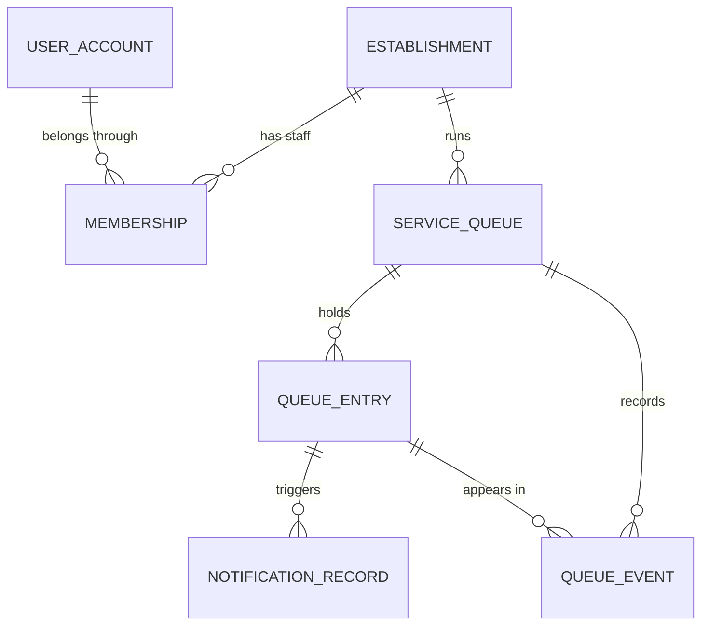
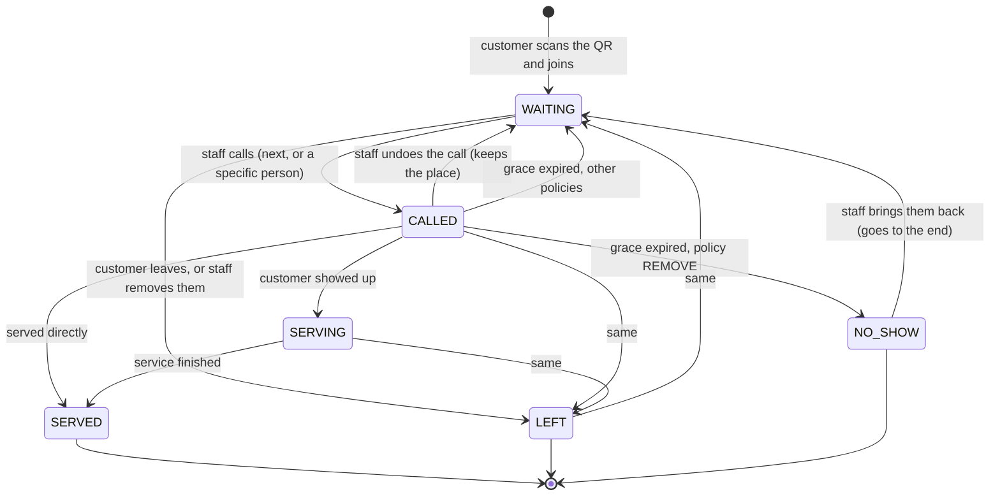

# Q (Queue) - domain model

Everything below is the MVP scope of *Funcionalidades 1-5* of the proposal, and nothing more.

## Entities



| Entity | Purpose |
|---|---|
| `user_account` | A staff-side login. Customers never get one. |
| `establishment` | A business location. Owns its time zone, which anchors "today" in metrics. |
| `membership` | Links a user to an establishment as `OWNER` or `STAFF`. |
| `service_queue` | One line = one service = one QR code. Holds all tunable behaviour. |
| `queue_entry` | One customer's place, addressed by an opaque `ticket_token`. |
| `queue_event` | Append-only timeline of everything that happened. |
| `notification_record` | One alert aimed at one customer, with its delivery outcome. |

### Why a customer has no account

The proposal asks for "datos minimos" and no app install. A customer supplies a name plus **at
least one contact channel**, and gets back an unguessable `ticket_token`. The token is the whole
credential: it is in the link that is sent to their contact channel, so closing the browser or
switching device costs them nothing.

## Ordering: how a position is decided

Positions are **never stored**. Each entry carries a sparse `order_key`, and the position is simply
its index in the `WAITING` list sorted by that key. This means a position can never disagree with
the real line.

Keys are handed out 1000 apart so a customer can be re-inserted between two neighbours without
rewriting every row behind them. If a gap ever runs out, the line is re-normalised back to even
spacing (`QueueOrdering`).

## Entry state machine



`WAITING`, `CALLED` and `SERVING` are **active**: they hold a place and count against `maxSize`.
`SERVED`, `LEFT` and `NO_SHOW` are terminal and stamp `finished_at`, which is what the metrics
window filters on.

## Queue status

| Status | New customers | Staff can call/serve |
|---|---|---|
| `OPEN` | yes | yes |
| `PAUSED` | no | yes |
| `CLOSED` | no | no |

Closing a queue **releases everyone still in it** as `LEFT` and sends them a `QUEUE_CLOSED`
notification. The alternative - leaving customers holding a place in a queue that stopped
operating - is worse than telling them.

## Grace period and no-show policies

When a customer is called, `grace_expires_at` is set to `now + gracePeriodSeconds`.
`gracePeriodSeconds = 0` means the clock never decides; only staff do.

When the deadline passes, the queue's `noShowPolicy` applies:

| Policy | Result |
|---|---|
| `KEEP_POSITION` | Back to `WAITING` in the same place. |
| `MOVE_BACK` | Back to `WAITING`, `moveBackPositions` places further down. |
| `MOVE_TO_END` | Back to `WAITING` at the end of the line. |
| `REMOVE` | `NO_SHOW`; the place is gone. |

Expiry is evaluated in **two** places, on purpose:

* **lazily**, on every read of a queue or a ticket, so a client is never shown a call the clock has
  already invalidated;
* **by a background sweep** (`GraceSweepJob`), so a queue nobody is watching does not stall on a
  customer who never showed up.

Both take the same per-queue lock, so they cannot fight each other or the staff panel.

## Estimated waiting time

```
averageServiceTime = mean of the last N completed services   (N = q.estimation.service-time-samples)
                     falling back to the queue's defaultServiceMinutes until there is any history

wait = ceil((peopleAhead + peopleBeingAttended) / serviceStations) x averageServiceTime
```

`peopleBeingAttended` (entries in `CALLED` or `SERVING`) is counted because those customers occupy
the service stations before anyone waiting gets a turn. There is no double counting: they are no
longer in the `WAITING` list.

Responses expose `usingDefaultServiceTime`, so the UI can be honest about an estimate that is a
configured guess rather than a measurement.

## Notifications

| Type | Fires when |
|---|---|
| `TICKET_CREATED` | On join. **Carries the personal ticket link.** |
| `APPROACHING_POSITION` | `peopleAhead <= notifyAtPosition` |
| `APPROACHING_TIME` | `estimatedWaitMinutes <= notifyAtMinutes` |
| `YOUR_TURN` | The customer is called. |
| `NO_SHOW` | The grace period expired; explains what the policy did. |
| `QUEUE_CLOSED` | The queue was closed while they waited. |

De-duplication is structural, not time-based: the unique key `(entry, type, notification_cycle)`
means a threshold alert fires **once per pass through the line**, however many times the queue
moves. When a customer is sent back to `WAITING` after a no-show, the cycle advances and the alerts
become eligible again - a second call really does produce a second "it's your turn".

Delivery happens **after the transaction commits**, so nobody is ever told about a change that then
rolled back. A delivery failure is recorded on the row and never propagated: a broken SMTP server
must not undo a legitimate queue movement. Channel selection prefers a configured real transport for
a contact the customer actually gave, and otherwise falls back to the always-available logging
transport.

## Metrics

Ranges are anchored to the **establishment's local calendar day**, not UTC, so "today" means what
the staff behind the counter think it means.

| Field | Definition |
|---|---|
| `waitingNow`, `inServiceNow` | Live counts. |
| `servedCount`, `noShowCount`, `leftCount` | Entries that reached that terminal state inside the range. |
| `averageWaitMinutes` | Mean of `calledAt - joinedAt` over served entries. |
| `averageServiceMinutes` | Mean of `finishedAt - servingStartedAt` over served entries. |
| `abandonmentRate` | `leftCount / finishedCount` |
| `noShowRate` | `noShowCount / finishedCount` |

## Concurrency

Every mutation begins by taking a **pessimistic write lock on the queue row**
(`ServiceQueueRepository.findByIdForUpdate`). That single lock is what makes the rest safe:

* two staff members pressing "call next" at the same moment serialise instead of calling the same
  person twice;
* simultaneous joins cannot be handed the same ticket number;
* the background sweep never races the panel.

Entry-addressed operations resolve the entry's queue id first (a projection query on an immutable
column), take the lock, and only then read the entry - so an entry is never read in a state another
transaction is about to change.
